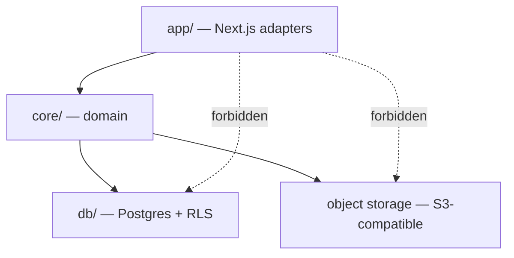
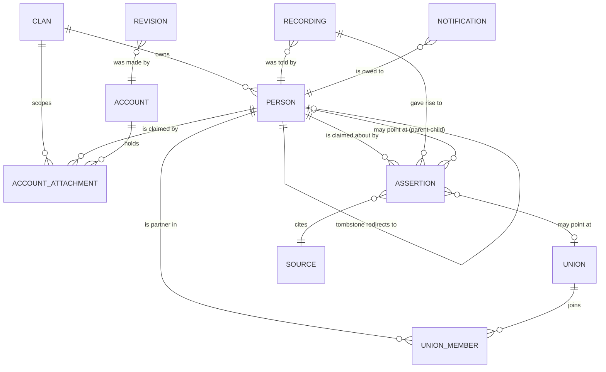
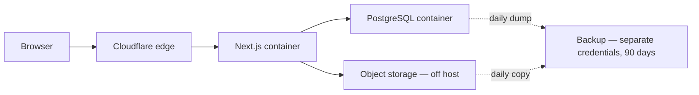

# Architecture Spine — Gia phả Nguyễn Quang, Đợt 1

## Design Paradigm

**Ports and adapters.** A domain core owns every read and write. Next.js — route handlers, Server Actions, React components — is an adapter with no database access of its own.

The core exists because four rules must hold on every data path and none of them can be re-implemented per route without eventually being forgotten: privacy radius (FR-37), clan partitioning, revision logging (FR-39), and two-tier write routing (FR-3).

```
core/          domain rules + the only database access in the system
  person/      person records, merge, tombstones
  assertion/   claims, sources, confidence tiers, promotion
  tree/        derived generation numbers, branch codes, ancestry paths, fragments
  identity/    account ↔ node attachment, roles, privacy radius
  media/       recording and image intake, access tiers, object-storage handles
  audit/       revision log, point-in-time reconstruction
db/            schema, migrations, RLS policies
app/           Next.js App Router — adapters only
```



## Invariants & Rules

### AD-1 — All data access flows through the core

- **Binds:** all
- **Prevents:** a new route reaching the database directly and silently skipping privacy, partitioning, logging, or write-tier rules
- **Rule:** `app/` must not import the database client, the ORM, or the storage SDK. Only `core/` may. Enforced by lint rule, not convention.

### AD-2 — A person is a row; assertions are evidence beside it `[ADOPTED]`

- **Binds:** FR-1, FR-2, FR-3, FR-48
- **Prevents:** two builders disagreeing on whether person identity is stored or derived from claims
- **Rule:** `person` holds a stable identity and the currently accepted values. `assertion` holds every **live** claim about a person with its source, confidence tier, and status — a claim rejected in favour of another leaves the live set and lives on in the revision log (AD-4), so `assertion` is the set of claims still standing, not the archive of all claims ever made. Reads take accepted values from `person`; provenance comes from `assertion`. **`core/assertion` is the sole writer of accepted values onto `person` (AD-19); no other module may write them.**

### AD-3 — Merge is destructive, tombstoned, and reversible by record

- **Binds:** FR-48, FR-39
- **Prevents:** an un-doable merge — the failure mode that turns a wrong guess into permanent data loss
- **Rule:** merging repoints every reference to the winning person and turns the loser into a tombstone row that redirects. The whole operation runs as one transaction that records every reference it repointed. A merge that does not record its repointings is not permitted, because un-merge is then impossible.

### AD-4 — A losing value leaves live data but never leaves the record

- **Binds:** FR-2, FR-39
- **Prevents:** a hard delete on conflict resolution, which would make point-in-time reconstruction lie
- **Rule:** when an approver picks between conflicting values, the losing value is removed from the live assertion set and written to the revision log with its source. `DELETE` on a value that was ever accepted is forbidden.

### AD-5 — Generation number and branch code are computed, never stored

- **Binds:** FR-63, FR-13, FR-15
- **Prevents:** stored positional values going stale the moment an ancestor is discovered above the current root
- **Rule:** no table has a generation column or a branch-code column. Both are computed at request time from the **accepted** parent-child assertions (AD-18). Caches, materialized paths, and denormalized copies are forbidden — they reintroduce exactly the staleness this rule exists to prevent.

### AD-6 — Internal identity is opaque and survives everything

- **Binds:** FR-63, FR-48, FR-39
- **Prevents:** identifiers that encode position, and therefore break when the root shifts or two records merge
- **Rule:** the primary key carries no meaning — not generation, not branch, not order of entry. Display codes like `1.3.2` are rendered, never stored, and never used as a key.

### AD-7 — Clan partitioning is enforced by the database, not by queries

- **Binds:** all, NFR multi-clan
- **Prevents:** one forgotten `WHERE` leaking one clan's data into another's
- **Rule:** every table carries a clan key. Row-level security policies filter on a per-request session variable set by the core when it opens the request's transaction. Application-layer filtering is defence in depth, never the primary mechanism.

### AD-8 — An account is not a person

- **Binds:** FR-64, FR-37, FR-55, FR-3
- **Prevents:** permissions keyed to login identity, which would grant a stranger with a valid Google account the access of a family member
- **Rule:** the account layer proves control of an email or social identity. Attachment to a clan node is a separate, vouched act. Write permission and privacy radius are computed from the **node**. An account with no attached node sees only public data.

### AD-9 — Everything enters as tentative; promotion is a status change

- **Binds:** FR-3, FR-2
- **Prevents:** two write paths — one "trusted", one reviewed — diverging in what they validate and log
- **Rule:** there is one write path. New assertions land at the tentative tier regardless of who wrote them. Promotion to the official tier is a status transition on the same row, performed by a role that holds the approval right, and logged like any other mutation.

### AD-10 — Every mutation writes a revision record

- **Binds:** FR-39, FR-3, FR-48, FR-55
- **Prevents:** history with holes, which makes point-in-time reconstruction unsound and un-merge impossible
- **Rule:** the core writes the revision record in the same transaction as the mutation. A write path that can succeed without producing a revision record is a defect.

### AD-11 — Irreplaceable media never lives in the database, and never only on the VPS

- **Binds:** FR-47, FR-49, NFR data durability
- **Prevents:** losing the one class of data that cannot be re-entered, because it shared a disk with data that can
- **Rule:** recordings and document images go to S3-compatible object storage off the host machine. PostgreSQL stores handles and metadata only. Restoring the database alone must never be mistaken for a restore.

### AD-12 — A recording's access tier is enforced in the core, at read time

- **Binds:** FR-49, FR-37
- **Prevents:** a sealed recording reachable through a route that forgot to check
- **Rule:** the core issues time-limited access to media and refuses when the caller's node fails the recording's tier — public, administrator-only, or sealed until a date. Storage URLs are never public and never long-lived.

### AD-13 — Privacy radius is computed, not configured

- **Binds:** FR-37, FR-55
- **Prevents:** a per-user settings surface nobody adjusts, leaving living people exposed by default
- **Rule:** visibility of a living person's detail is derived from relationship distance between viewer node and subject node. **No viewer-facing setting widens it.** The subject may restrict their own visibility further (FR-55) — a subject's own choice may only narrow, never widen. Minors are restricted further. Default is the restrictive branch.

Distance is measured over **both** accepted parent-child assertions **and** union edges. Blood edges alone would place a daughter-in-law at infinite distance from her own husband's family — excluding, by the privacy engine itself, one of the four user groups the product exists to serve.

### AD-14 — Nothing about this particular clan is hard-coded

- **Binds:** NFR multi-clan
- **Prevents:** a second clan requiring a fork instead of a row
- **Rule:** surname, the fixed middle name, branch count, root ancestor, and clan-specific rules are data. A literal referring to the Nguyễn Quang clan anywhere in `core/` or `db/` is a defect.

### AD-15 — A living person is told when the record about them changes

- **Binds:** FR-55, FR-11, FR-39
- **Prevents:** the right to know degrading into a right nobody exercises, because nothing tells them there is anything to know
- **Rule:** when a living person is added, or an accepted value about them changes, the core emits a notification event in the same transaction as the revision record. Delivery is asynchronous and may fail; **emitting the event may not.** The event outlives delivery, so someone unreachable today can still be reached later.

### AD-16 — Vietnamese name matching folds diacritics and case

- **Binds:** FR-11, FR-48, FR-51, NFR Vietnamese-first
- **Prevents:** two lookup paths disagreeing — one matching `Nguyễn` only, another also matching `nguyen` — which at FR-11 step two means a contributor cannot find their own father and leaves
- **Rule:** every name lookup and duplicate-candidate comparison normalises through `unaccent` and folds case before matching. A bare `LIKE` or `ILIKE` against a name column is a defect. Stored names keep their diacritics; only the comparison is folded.

### AD-17 — A reported assertion hides first and is judged after

- **Binds:** FR-49, FR-3, FR-55
- **Prevents:** an assertion that wounds a living person, or the memory of a dead one, staying visible for as long as review takes — on a write path that publishes before approval
- **Rule:** because AD-9 makes new assertions visible immediately at the tentative tier, a single report puts an assertion into a hidden state with no approval required. Restoring it requires the approval right; hiding it does not.

### AD-18 — A parent-child relationship is an assertion, not a plain edge

- **Binds:** FR-1, FR-2, FR-3, FR-15, FR-63, FR-48
- **Prevents:** the single most important claim in the whole product — *"A is the child of B"* — being the one claim with no source, no confidence tier, and no approval path
- **Rule:** parent-child is stored as an assertion whose subject is a person and whose object is another person, carrying source, tier, and status like any other. The tree is built from **accepted** parent-child assertions only. No module may insert a relationship row directly; a relationship enters exactly the way a birth year does.

*The PRD defines an assertion with this very example. A relationship table outside the assertion system would let the tree render one truth while the confidence colouring reads another.*

### AD-19 — `core/assertion` owns every write of an accepted value

- **Binds:** FR-3, FR-55, FR-2, FR-39
- **Prevents:** promotion that updates nothing, and a self-edit that a later projection silently overwrites
- **Rule:** promoting an assertion to the official tier and projecting its value onto `person` are one operation in one transaction, performed only by `core/assertion`. A person exercising their FR-55 right to correct their own data does so **by writing an assertion**, not by writing to `person`. No path updates an accepted value without an assertion behind it.

### AD-20 — Row-level security is forced, unowned, and never silently absent

- **Binds:** all, NFR multi-clan
- **Prevents:** policies that exist, appear in the schema, and do nothing — because PostgreSQL exempts the table owner from RLS unless forced, while AD-7 has already told the core to stop writing `WHERE clan_id`
- **Rule:** every partitioned table declares both `ENABLE` and `FORCE ROW LEVEL SECURITY`, and the application connects as a role that **does not own** those tables and does not hold `BYPASSRLS`. Policies read the clan context in a form that **fails closed**: an unset context yields no rows, never all rows. Every execution path outside a request — migrations, the FR-51 seed import, background jobs, restores — sets the clan context explicitly or refuses to run.

Two release gates, not optional checks: a test that seeds two clans and asserts neither can read the other, and a schema check that fails when any partitioned table lacks an enabled, forced policy. Each of these four details fails **silently** on its own — a policy that exists and does nothing looks identical in the schema to one that works.

> **Sửa đổi 25/08/2026 — bảng `clan` là DANH BẠ, không phải dữ liệu phân vùng.**
> `SELECT` trên riêng bảng `clan` nay mở, không cần clan context (migration `0002_clan_directory`).
> Lý do: fail-closed trên bảng ấy làm câu *"triển khai này phục vụ dòng họ nào?"* không trả lời
> được từ database, buộc phải chép id ra `GIAPHA_CLAN_ID` trong `.env` — một sự thật ở hai nơi,
> lệch nhau sau mỗi lần dựng lại. Bảng `clan` chứa `id`, `name`, `settings` (họ · chữ đệm · đề
> từ), `created_at`: dữ liệu về DÒNG HỌ, không về NGƯỜI.
>
> **Không đổi:** mọi lối GHI vào `clan` vẫn buộc `id = current_clan_id()`, và cả mười bảng phân
> vùng giữ nguyên `USING (clan_id = current_clan_id())` fail-closed. Phần AD-7 thật sự bảo vệ —
> cách ly dữ liệu gia phả — không suy suyển.
>
> Gate đã cập nhật cùng lượt và nay khẳng định điều mạnh hơn: danh bạ đọc được **và** ghi vẫn bị
> chặn. Nới `SELECT` cho một bảng phân vùng vẫn làm gate gãy.

### AD-21 — The privacy radius binds every read path, not just the person record

- **Binds:** FR-37, FR-55, FR-49, FR-39
- **Prevents:** the assertion list, the revision history, and point-in-time reconstruction quietly serving what the person view is careful to withhold
- **Rule:** AD-13's radius is applied by the core to every read of person data in any shape — accepted values, assertions, revision entries, reconstructed past states, and media metadata. Because AD-4 makes the revision log a permanent record of every value ever withdrawn, unfiltered access to history is a disclosure channel, and is treated as one.

### AD-22 — Merging requires the approval right

- **Binds:** FR-48, FR-3
- **Prevents:** the only destructive operation in the system being the only one that needs no permission
- **Rule:** proposing a merge is open to any attached member; executing one requires the approval right. A duplicate suggestion is a proposal, never an action.

### AD-23 — Nothing viewer-dependent is cached outside the core

- **Binds:** FR-37, FR-55, FR-49
- **Prevents:** the framework and the CDN re-serving one viewer's permitted view to a viewer with a different radius — reintroducing at the infrastructure layer exactly what AD-21 closes in the application
- **Rule:** any response whose content depends on who is asking is rendered dynamically and marked uncacheable, at the framework's route cache and at the edge. Only genuinely public, viewer-independent responses may be cached.

### AD-24 — The core reads identity from the session; it never accepts it as an argument

- **Binds:** all, FR-64, FR-37, FR-3
- **Prevents:** an adapter that obeys AD-1 to the letter — importing no database client — and then simply *tells* the core which clan and which node it is acting as
- **Rule:** no exposed core operation takes clan, viewer node, or role as a parameter. The core resolves all three from the authenticated session itself, at the start of the transaction. An adapter can ask for work; it cannot assert who it is.

*Without this, AD-1's boundary holds while AD-7 and AD-13 are bypassed through the front door, and every lint check still passes.*

### AD-25 — A backup is not a backup until it has been restored

- **Binds:** FR-47, FR-49, NFR data durability
- **Prevents:** the product's number-one stated risk — losing the one class of data that cannot be re-created — being managed by an arrangement nobody has ever tested
- **Rule:** database and object storage are both backed up daily to a destination under separate credentials from production, with **90 days** of history retained. A provider's internal redundancy does not count as the second copy: it protects against their disk failing, not against our deletion, our corruption, or our lost key. A restore is performed and verified at least once a year; a backup that has never been restored is treated as absent.

## Consistency Conventions

| Concern | Convention |
| --- | --- |
| Naming — entities | Singular English nouns in code and schema: `person`, `assertion`, `revision`, `recording`, `clan`, `account`, `attachment`. Vietnamese domain terms live in the UI layer and in comments, never in identifiers. |
| Naming — core operations | Verb-first and intention-revealing: `mergePersons`, `promoteAssertion`, `attachAccountToNode`. Never `update*` or `handle*`. |
| Identifiers | UUIDv7 primary keys — opaque, sortable by creation, no positional meaning (AD-6). |
| Dates | `timestamptz` in UTC at rest. Lunar dates are a separate, explicitly named field, never a converted timestamp. |
| Uncertain dates | A genealogical date is a value plus a precision marker (exact / year-only / approximate / unknown). Never an exact timestamp standing in for a guess. |
| Errors | The core returns typed results; it does not throw for expected outcomes such as a rejected merge or a denied read. Adapters translate to HTTP. |
| Transactions | The core opens the transaction, sets the clan session variable, and does all work inside it. Adapters never manage transactions. |
| Migrations | Forward-only, checked into the repo, applied on deploy. No manual schema changes on the server — NFR one-person handover depends on the repo being the whole truth. |
| Config | Environment variables only, documented in a committed example file. No secret in the repo. |

## Stack

| Name | Version |
| --- | --- |
| PostgreSQL | 18.4 |
| Node.js | current LTS |
| Next.js | 16.3.0 |
| React | 19.2.8 |
| TypeScript | 7.0.2 |
| Tailwind CSS | 4.3.3 |
| Drizzle ORM | 0.45.2 |
| Better Auth | 1.6.26 |
| Docker Compose | on the existing Ubuntu VPS |
| Object storage | S3-compatible — Cloudflare R2 as seed |
| `unaccent`, `pg_trgm` | PostgreSQL contrib — ship with the standard image |

Better Auth covers the account layer only — Google, Facebook, and password. The clan-node attachment layer is ours (AD-8), and it is where permission actually comes from. Its declared peer ranges cover Next.js 16, React 19, `pg` 8, and Drizzle ORM `^0.45.2` — the exact line pinned above — and it ships a Drizzle adapter, so nothing here is held together by a version override.

No **third-party** PostgreSQL extension is required for Đợt 1. `unaccent` and `pg_trgm` are contrib modules included in the standard PostgreSQL distribution, enabled with `CREATE EXTENSION`; they need no custom image. Apache AGE, pgvector, and pg_search are deferred.

## Structural Seed



Relationships only. Attributes that are themselves invariants are ADs, not diagram nodes.

There is no parent-child table. A relationship is an assertion pointing from one person to another (AD-18), so it carries source, tier, and approval exactly like a birth year, and the tree is built from the accepted ones.

`UNION` carries marriage and partnership. It is a separate entity rather than a column on `PERSON` for three reasons the domain forces: a person may have more than one union across a lifetime; the chính phả / ngoại phả distinction is a property of how someone entered the clan, not of the person alone — a wife is recorded in the main line under her husband, while a son-in-law's descendants belong to another surname; and adoption, heirship, and children born outside a union attach as their own parent-child assertions regardless of whether a `UNION` exists.



One VPS, two containers, media and backups off the machine. The backup destination holds credentials separate from production, so a compromise or a mistake on one side cannot reach the other — provider redundancy alone would not survive our own deletion (AD-25).

```text
gia-pha/
  app/            # Next.js App Router — adapters only
    uiworkshop/   # prototype surface; notFound() in production
  components/ui/  # shadcn primitives, owned in-repo
  core/           # domain; the only code that may reach db/ or storage
  db/             # schema, migrations, RLS policies
  specs/          # frontend writing contract
  _bmad-output/   # planning artifacts
```

`app/` sits at the repository root, not under `src/` — the UI workshop kit requires it there and rejects `src/app` outright. The `@/*` alias therefore resolves to the repository root, so `@/core`, `@/db`, and `@/components/ui` are the import paths AD-1's lint rule governs.

## Capability → Architecture Map

| Capability | Lives in | Governed by |
| --- | --- | --- |
| FR-51 seed the clan skeleton | `core/person`, `core/tree` | AD-2, AD-7, AD-9 |
| FR-63 derived root | `core/tree` | AD-5, AD-6 |
| FR-11 four-step self-registration | `app/`, `core/identity` | AD-1, AD-8, AD-9, AD-16 |
| FR-13 immediate reward | `core/tree` | AD-5 |
| FR-15 family tree | `app/`, `core/tree` | AD-5, AD-13 |
| FR-47 capture recordings | `core/media` | AD-11, AD-12 |
| FR-49 consent and sealing | `core/media` | AD-12, AD-17, AD-10 |
| FR-1 sourced assertions | `core/assertion` | AD-2, AD-10 |
| FR-2 confidence tiers | `core/assertion` | AD-2, AD-4 |
| FR-3 two tiers | `core/assertion` | AD-9, AD-10 |
| FR-64 login and roles | `core/identity` | AD-8, AD-7 |
| FR-48 fragment merging | `core/person` | AD-3, AD-6, AD-10, AD-16 |
| FR-37 privacy radius | `core/identity` | AD-13, AD-1 |
| FR-55 living-person rights | `core/identity`, `core/assertion` | AD-13, AD-15, AD-4, AD-10 |
| FR-39 revision log | `core/audit` | AD-10, AD-4 |

## Deferred

| Deferred | Why it can wait |
| --- | --- |
| Apache AGE | Recursive CTE is faster than AGE for the ancestry walk this product does, and the clan is two orders of magnitude below where a graph store pays. Revisit only if a real query proves too slow. |
| pgvector, pg_search, ParadeDB | They serve Quang Gia Tộc Sử (F7) only, which is outside Đợt 1. Adding them later is an extension install, not a migration. |
| Speech-to-text provider | FR-47 stores audio; FR-8 transcribes it and is outside Đợt 1. The provider choice carries a privacy decision about the most sensitive data in the system and deserves its own deliberation. |
| Multi-clan onboarding | AD-7 and AD-14 make a second clan possible; nothing builds the flow for registering one. That is a separate product decision, not an architectural one. **Chốt 25/08/2026: nhận việc, làm ở Đợt 3** — xem ghi chú ngay dưới bảng. |
| Deployment specifics | Host, domain, and TLS are settled at deploy time. Backup destinations are **not** deferred — AD-25 binds them. |
| Metrics collection | Measured by hand at this scale — a monthly SQL query, not an instrumentation layer. |

> ### Đợt 3 — Admin hệ thống (chốt 25/08/2026)
>
> **Hình dáng đã chốt:** một vai đứng TRÊN dòng họ, quản được nhiều dòng họ và đặt được quản trị
> cho từng dòng họ. Chỗ đặt nó đã sẵn: `user` / `account` / `session` nằm ngoài phân vùng RLS
> theo AD-8, nên vai cấp hệ thống thuộc về bảng `user` — không phải `attachment`.
>
> **Bốn thứ nó kéo theo, không thứ nào nhỏ:**
> 1. Cột vai trên `user`, cộng các ops chạy xuyên dòng họ (tạo · liệt kê · đặt quản trị) — mỗi
>    thao tác tự mở `withClanContext` cho dòng họ đích.
> 2. `soleClanId()` **biến mất**. Phiên lấy clan từ `attachment` của tài khoản; khách chọn qua
>    subdomain hoặc đoạn đường dẫn.
> 3. Một bề mặt mới. `/admin` là bàn của MỘT dòng họ; bàn quản trị hệ thống là chỗ khác.
> 4. **Sửa AD-8.** Hôm nay *"vai tính từ node"*; vai hệ thống tính từ **tài khoản**.
>
> **Vì sao không làm ở Đợt 2:** Epic 5 dựng `/admin` trên mô hình một-dòng-họ. Làm bây giờ thì
> 5-2 → 5-8 xây trên một mô hình phiên sắp thay.
>
> **Nó KHÔNG xoá được bài toán con-gà-quả-trứng, chỉ lùi lên một tầng.** Vẫn phải có một hành
> động từ ngoài tạo ra người có quyền đầu tiên. `scripts/create-admin.ts` giữ đúng vai đó, và ở
> Đợt 3 chỉ đổi thứ nó tạo ra: admin hệ thống thay vì admin dòng họ.
| Full role-management UI | AD-8 fixes how roles bind; the screen that administers them is post-Đợt-1. |
